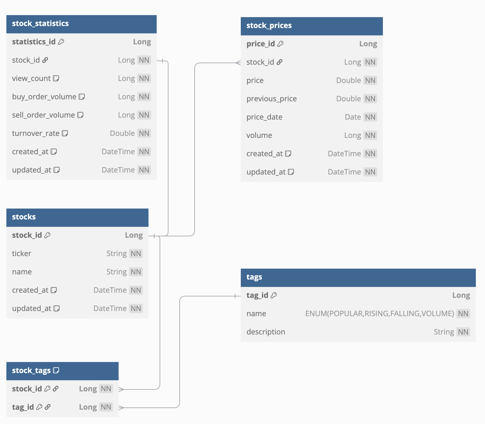

# 📈 주식 정보 API

## 1. 개요

본 프로젝트는 주식 정보를 제공하는 API 서비스입니다. 
주식의 **기본 정보**, **가격**, **통계**, **태그** 등을 관리하고 조회할 수 있는 기능을 구현하여, 
**RESTful API 설계와 Spring Boot 기반의 백엔드 기술**을 학습하고 실습하기 위해 만들어졌습니다.

이 문서는 전체 시스템의 설계 및 구현 개요를 제공합니다.

---

## 2. 설계 상세 내용

### 2.1 데이터 모델 설계

주식 정보를 저장하고 효율적으로 조회하기 위해 아래와 같은 엔티티 구조를 설계했습니다:

- **Stock**: 주식 기본 정보 (ID, 코드, 이름 등)
- **StockPrice**: 주식 가격 정보 (현재가, 전일가, 거래량, 날짜 등)
- **StockStatistics**: 주식 통계 정보 (조회수, 매수/매도 잔량, 회전율 등)
- **Tag**: 태그 정보 (인기, 상승, 하락, 거래량 등)

#### 💡 설계 장점

- **데이터 분리**  
  → 자주 변경되는 데이터(가격, 통계)와 고정적인 데이터(기본 정보)를 분리하여 성능 향상
- **이력 관리**  
  → `StockPrice` 테이블을 통해 가격 이력 추적 가능
- **확장성**  
  → 향후 재무정보, 뉴스 등 다양한 데이터 추가에 유리한 구조

#### 📊 데이터베이스 ERD

>   
> 자세한 테이블 정의는 `docs/schema.sql`에서 확인할 수 있습니다.

---

### 2.2 API 설계

아래와 같은 RESTful API를 제공합니다:

1. **태그별 주식 조회**  
   `GET /api/stocks?tag={tag}&page={page}&size={size}`  
   → 특정 태그 기준으로 주식 리스트를 페이징하여 조회  
   → `StockSearchRequest` DTO로 파라미터 검증

2. **주식 상세 정보 조회**  
   `GET /api/stocks/{ticker}`  
   → 특정 티커 기준 주식 상세 정보 조회  
   → 응답 형식: `StockDetailResponse`

3. **테스트용 API**  
   `POST /api/test/update-data`  
   → 랜덤 데이터 생성 및 업데이트  
   → 파라미터: `tagType`, `count`, `minRate`, `maxRate`

---

### 2.3 응답 형식 표준화

모든 API 응답은 다음과 같은 형식의 `ApiResponse<T>`로 표준화됩니다:

```json
{
  "success": true,
  "data": { ... },
  "paging": {
    "page": 0,
    "size": 10,
    "totalElements": 100,
    "totalPages": 10
  }
}
```

- 응답 일관성 유지
- 클라이언트 측 처리 용이성 확보

---

### 2.4 데이터베이스 설계 전략

- JPA 기반 스키마 자동 생성
- 초기 데이터는 `data.sql`을 통해 자동 로딩
- 개발 환경에서는 **H2 Database**를 사용

---

## 3. 핵심 문제해결 전략

### 3.1 실시간 데이터 처리

- **효율적인 쿼리 설계**  
  → 태그 기준 주식 목록을 빠르게 조회할 수 있는 조건 최적화
- **랜덤 데이터 시뮬레이션 기능**  
  → `TestService`를 통해 변동률 범위와 태그 기반으로 랜덤 업데이트 수행

### 3.2 캐싱 전략

- **캐시 관리**  
  → 자주 조회되는 주식 정보에 대해 메모리 캐시 적용  
  → `TestController.getCacheStats()`를 통해 캐시 상태 점검 가능

- **캐시 갱신 정책**  
  → 데이터 업데이트 시 관련 캐시 자동 갱신  
  → 태그별로 캐시 적용 가능하여 불필요한 리소스 낭비 최소화

> ✅ 향후 Redis 또는 외부 캐시 서버 적용 예정

---

## 4. 기술 스택

| 구분           | 기술                                |
|----------------|-------------------------------------|
| 언어 및 프레임워크 | Kotlin, Spring Boot               |
| ORM 및 DB        | JPA(Hibernate), H2 Database       |
| API 설계         | Spring Web, RESTful API           |
| 검증            | Jakarta Bean Validation            |
| 응답 처리        | ResponseEntity, Custom ApiResponse|

---

## 5. 추가 자료

- **ERD 이미지**: `docs/erd.png`
- **스키마 정의 SQL**: `docs/schema.sql`

---

## 6. 고려해볼만한 사항들

현재 구현된 주식 정보 API는 기본적인 데이터 관리 및 조회 기능을 중심으로 구성되어 있습니다. 
실무나 확장된 프로젝트 환경을 염두에 둘 때, 다음과 같은 기능이나 구조를 추가로 고려해보면 서비스의 완성도와 실용성을 높일 수 있습니다:

### ✅ 주식 데이터 고도화

- **재무 정보 연동**  
  → 기업의 실적, PER, ROE 등 주요 투자 지표 제공을 통한 정보 보강
- **뉴스 및 공시 연동**  
  → 종목별 뉴스, 공시, 이슈 데이터를 외부 API 또는 크롤링으로 연결

### ✅ 사용자 중심 기능

- **관심 종목 즐겨찾기**  
  → 사용자가 즐겨찾는 주식을 저장 및 관리할 수 있는 기능
- **개인화 추천 기능**  
  → 사용자의 검색/조회 이력을 바탕으로 종목 추천 제공

### ✅ 데이터 시각화

- **차트 API 제공**  
  → 주식 가격, 거래량, 회전율 등의 데이터를 시계열 그래프로 시각화할 수 있는 형태로 제공

### ✅ 운영 및 관리 편의성

- **관리자 대시보드**  
  → 종목 통계, API 호출 현황, 캐시 상태 등을 한눈에 볼 수 있는 UI 도입
- **API 모니터링 및 요청 제한**  
  → API 사용량 추적 및 사용자별 요청 제한(QPS 제한) 기능 고려

### ✅ 구조 및 성능 개선

- **비동기 처리 도입**  
  → 데이터 업데이트 및 알림 등을 비동기 이벤트 기반으로 처리하여 응답 속도 개선
- **배치 스케줄링**  
  → 주기적인 데이터 업데이트, 통계 정리 작업을 위한 스케줄러 적용

이러한 기능들은 서비스 확장, 사용자 편의성 향상, 시스템 안정성 확보 측면에서 중요한 고려 요소가 될 수 있습니다.

---
